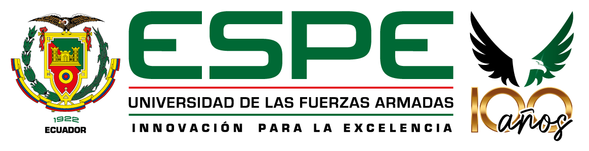

# Universidad de las Fuerzas Armadas "ESPE"
## Nombre
Carlos Campoverde
Mateo Jarén García Galarza
Jonathan Javier Jaguaco Quituisaca
Erick Patricio Obando Zapato
## Asignatura:
36902-Desarrollo de Software Seguro

## Docente:
Angel Geovanny Cudco Pomoguali

# SecurityShop_ObandoJaguacoCampoverde
SecurityShop
# Actividad 1:

* Crear un repositorio de Github
* Identificar al menos diez activos de SecureShop:
  * Información de usuarios
  * Credenciales
  * Catálogo de productos
  * Precio de productos
  * Microservicio de usuario 
  * MIcroservicio de producto
  * Microservicio de pedido
  * Procesamiento de pago
  * Base de datos de productos
  * Información de pedidos
  * Código fuente de los microservicios
  * Logs y registros de auditoría
  * Base de datos de pedidos
  * Base de datos de usuarios
  * API Gateway 

* Clasificar cada activo según:
  * información;
  * software;
  * servicio;
  * infraestructura;
  * datos.

### Responder:
**¿Qué consecuencias tendría para SecureShop que este activo fuera accedido, modificado o quedara indisponible?**

| Activo | Tipo | Consecuencia (Acceso / Modificación / Indisponibilidad) | 3 Amenazas | Control |
| :--- | :--- | :--- | :--- | :--- |
| **Información de usuarios** | Información | Se podría exponer información de los usuarios, afectando su privacidad y confianza en SecureShop. | - Suplantación de identidad - Filtración de datos personales - Alteración de datos personales | Cifrado Absoluto de Datos |
| **Credenciales** | Información sensible | Un acceso no autorizado podría permitir que terceros entren a las cuentas de los usuarios. | - Eliminación de credenciales - Manipulación de información personal - Secuestro de cuenta | Implementar autenticación Multifactor (MFA) |
| **Catálogo de productos** | Información | Su modificación podría mostrar precios, características o productos incorrectos. | - Inyección SQL - Modificación del stock de productos - Modificación de la descripción de productos | Zero Trust, nunca validar el producto basándose en los datos que se envían desde el navegador. |
| **Precio de Productos** | Información | Realizar compras de varios productos al precio más bajo posible, afectando el stock y el dinero obtenido para SecureShop. | - Fraude por interceptación - Sabotaje del catálogo de productos - Ataque de condición de carrera para pagar solo por una compra al hacer múltiples órdenes | Validación estricta en el servidor con bloqueos transaccionales |
| **Microservicio de usuario** | Software | Fallas en el registro y autenticación de los usuarios al intentar loguearse, provocando desconfianza en la tienda. | - Caída del servidor - Bloqueo erróneo de cuentas legítimas - Lentitud al procesar registros o validaciones | Implementar un servicio de autenticación desacoplado al microservicio del usuario. |